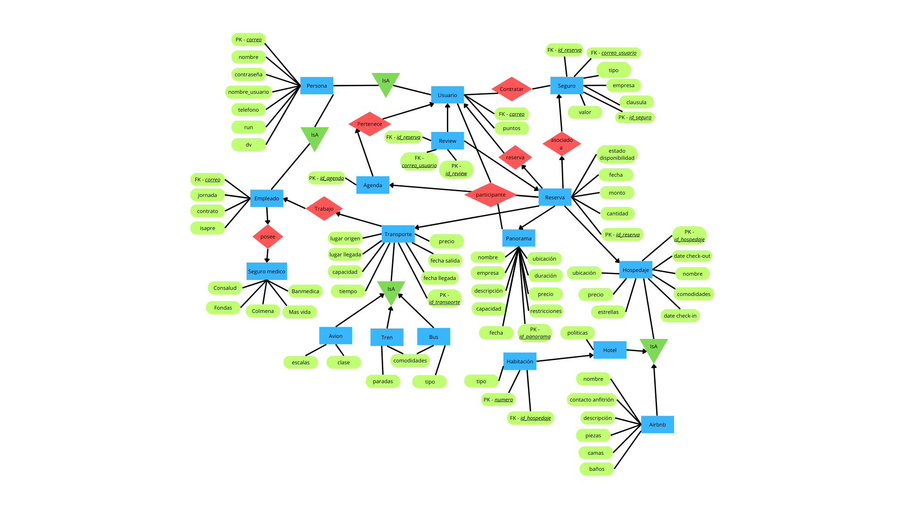

# Entrega 1 - Bases de datos IIC2413

### Datos del Alumno
| **Nombre Completo** | **Número de Alumno** |
|---------------------|----------------------|
| Martin Nuñez        |             23645997 |

### Credenciales de acceso

| **Usuario Uc**             | **Contraseña** |
|----------------------------|----------------|
| mnunezvan@bdd1.ing.puc.cl  |       23645997 |

### 1. Modelo E/R 

ruta: Sites/E1/diagrama.png

### 2. Identificación de entidades débiles y justificación

#### 2.1 Entidad
En el diagrama la entidad __Habitación__ es débil porque depende de una entidad fuerte que es __Hotel__ y no tiene una llave primaria
En el diagrama la entidad __Review__ es débil porque depende de una entidad fuerte que es __Usuario__ y no tiene una llave primaria

### 3. Identificación de llaves primerarias/compuesta y justificación

#### 3.1 Llaves primarias

- La llave primaria en la entidad __Persona__ es el atributo __correo__ porque es un identificador unico principal para todas las personas y que no se puede repetir
- La llave primaria en la entidad __Usuario__ es el atributo __correo__ porque corresponde a una especializacion de las personas y sigue siendo un identificador unico 
- La llave primaria en la entidad __Empleado__ es el atributo __correo__ porque corresponde a una especializacion de las personas y sigue siendo un identificador unico 
- La llave primaria en la entidad __Agenda__ es el atributo __id_agenda__ porque es un identificador unico principal para todas las agendas y que no se puede repetir
- La llave primaria en la entidad __Reserva__ es el atributo __reserva__ porque es un identificador unico principal para todas las reservas y que no se puede repetir
- La llave primaria en la entidad __Review__ es el atributo y __id_review__ porque es un identificador unico principal para todas las review y que no se puede repetir
- La llave primaria en la entidad __Seguro__ es el atributo __id_seguro__ porque es un identificador unico principal para todas los seguros y que no se puede repetir
- La llave primaria en la entidad __Hospedaje__ es el atributo __id_hospedaje__ porque es un identificador unico principal para cada hospedaje y que no se puede repetir
- La llave primaria en la entidad __Panorama__ es el atributo __id_panorama__ porque es un identificador unico principal para cada panorama y que no se puede repetir
- La llave primaria en la entidad __Transporte__ es el atributo __id_transporte__ porque es un identificador unico principal para cada hospedaje y que no se puede repetir

#### 3.2 Llaves compuestas

- La llave compuesta en la entidad __Habitacion__ son los atributos __numero__ y __id_hospedaje__ porque es un identificador unico principal para todas las habitaciones y que no se puede repetir
- La llave compuesta en la entidad __Review__ son los atributos __correo_usuario__ y __id_reserva__ porque es un identificador unico principal para todas las review y que no se puede repetir

### 4. Explicación cardinalidades modelo E/R

#### 4.1 Usuario y Agenda {0 a n, 1}
__Usuario__ puede tener 0 o varias instancias de __Agenda__. 1 __Agenda__ tiene solo 1 instancia de __Usuario__.

#### 4.2 Usuario y Review {0 a n, 1}
__Usuario__ puede tener 0 o varias instancias de __Review__. 1 __Review__ tiene solo 1 instancia de __Usuario__.

#### 4.3 Usuario y Seguro {0 a n, 0 a n}
__Usuario__ puede tener 0 o varias instancias de __Seguro__. 1 __Seguro__ puede tener 0 o varias instancias de  __Usuario__.

#### 4.4 Usuario y Reserva {0 a n, 1}
__Usuario__ puede tener 0 o varias instancias de __Reserva__. 1 __Reserva__ tiene solo 1 instancia de __Usuario__.

#### 4.5 Seguro y Reserva {0 a n, 1}
__Seguro__ puede tener 0 o varias instancias de __Reserva__. 1 __Reserva__ tiene solo 1 instancia de __Seguro__.

#### 4.6 Reserva y Review {0 a n, 1}
__Reserva__ puede tener 0 o varias instancias de __Review__. 1 __Review__ tiene solo 1 instancia de __Reserva__.

#### 4.7 Agenda y Reserva {0 a n, 1}
__Agenda__ puede tener 0 o varias instancias de __Reserva__. 1 __Reserva__ tiene solo 1 instancia de __Agenda__.

#### 4.8 Trandporte y Reserva {0 a n, 1}
__Transporte__ puede tener 0 o varias instancias de __Reserva__. 1 __Reserva__ tiene solo 1 instancia de __Transporte__

#### 4.9 Panorama y Reserva {0 a n, 1}
__Panorama__ puede tener 0 o varias instancias de __Reserva__. 1 __Reserva__ tiene solo 1 instancia de __Panorama__

#### 4.10 Hospedaje y Reserva {0 a n, 1}
__Hospedaje__ puede tener 0 o varias instancias de __Reserva__. 1 __Reserva__ tiene solo 1 instancia de __Hospedaje__

#### 4.11 Agenda y Reserva {0 a n, 1}
__Agenda__ puede tener 0 o varias instancias de __Reserva__. 1 __Reserva__ tiene solo 1 instancia de __Agenda__

#### 4.12 Seguro_medico y Empleado {0 a n, 1}
__Seguro_medico__ puede tener 0 o varias instancias de __Empleado__. 1 __Empleado__ tiene solo 1 instancia de __Seguro_medico__

#### 4.13 Empleado y Transporte {0 a n, 1}
__Empleado__ puede tener 0 o varias instancias de __Transporte__. 1 __Transporte__ tiene solo 1 instancia de __Empleado__

#### 4.14 Hotel y Habitacion {0 a n, 1}
__Hotel__ puede tener 0 o varias instancias de __Habitacion__. 1 __Habitacion__ tiene solo 1 instancia de __Hotel__

### 5. Identificación de jerarquías

En el diagrama se da que la entidad __Persona__ es entidad padre de las entidades __Usuario__ y de __Empleado__ dado que son tipos de persona y heredan los atributos de la superclase
En el diagrama se da que la entidad __Transporte__ es entidad padre de las entidades __Avion__, __Tren__ y de __Bus__ dado que son tipos de transporte y heredan los atributos de la superclase
En el diagrama se da que la entidad __Hospedaje__ es entidad padre de las entidades __Hotel__ y de __Airbnb__ dado que estos son tipos de hospedaje y heredan los atributos de la superclase

### 6. Esquema Relacional

__Persona__ : (correo: varchar, nombre: varchar, contraseña: varchar, nombre_usuario: varchar, telefono: int, run: int, dv: int)
__Usuario__ : (correo: varchar, nombre: varchar, contraseña: varchar, nombre_usuario: varchar, telefono: int, run: int, dv: int, puntos: int)
__Empleado__ : (correo: varchar, nombre: varchar, contraseña: varchar, nombre_usuario: varchar, telefono: int, run: int, dv: int, jornada: varchar, contrato: varchar, seguro_medico: varchar)
__Agenda__ : (id_agenda: serial, correo_usuario: varchar, etiqueta: int)
__Reserva__ : (id_reserva: serial, fecha: date, monto: decimal, cantidad_personas: int, estado_disponibilidad: bool, id_agenda: int/null)
__Review__ : (correo_usuario: varchar, id_reserva: int, estrellas: int, descripcion: text)
__Seguro__ : (id_seguro: serial, tipo: varchar, clausula: text, empresa: varcha, valor: decimal, correo_usuario: varchar, id_reserva: int)
__Hospedaje__ : (id_hospedaje: serial, nombre: varchar, ubicacion: varchar, precio: decimal, estrellas: int, comodidades: text, check_in: date, check-out: date)
__Hotel__ : (id_hospedaje: int, politicas: text)
__Airbnb__ : (id_hospedaje: int, nombre_anfitrion: varchar, contacto_anfitrion: int, descripcion: text, piezas: int, camas: int, baños: int)
__Habitacion__ : (id_hospedaje: int, numero: int, tipo: varchar)
__Transporte__ : (id_transporte: serial, origen: varchar, destino: varchar, capacidad: int, duracion: int, precio: decimal, empresa: varchar, fecha_salida: date, fecha_llegada: date)
__Avion__ : (id_transporte: int, clase: varchar, escalas: text)
__Tren__ : (id_transporte: int, comodidades: text, paradas: text)
__Bus__ : (id_transporte: int, comodidades: text, tipo: varchar)
__Panorama__ : (id_panorama: serial, nombre: varchar, empresa: varchar, descripcion: text, ubicacion: varchar, duracion: int, precio: decimal, capacidad: int, restricciones: text, fecha: date)

### 7. Justificación de tablas de relaciones

#### 7.1 Reserva
Representa la relación de __Usuario__ y __Panorama__, __Hospedaje__ o __Transporte__ porque tiene atributos propios y relaciona multiples entidades

#### 7.2 Review
Representa la relación de __Usuario__ y __Reserva__ porque tiene atributos propios aparte de la realcion que hace

#### 7.3 Seguro
Representa la relación de __Usuario__ y __Reserva__ porque tiene atributos propios aparte de la realcion que hace

### 8. Justificación sobre la consistencia del diseño del esquema relacional y normalización en BCNF

Este esquema resuelve los temas de Fidelidad, Redundancia, Anomalías, Simplicidad y Buena elección de llaves primarias 
- Fidelidad: Mantiene una fidelidad alta respecto al dominio de la aplicación Booked.com, ya que representa correctamente las reglas de negocio entregadas en el enunciado y refleja adecuadamente, las jerarquías y especializaciones
- Redundancia: El modelo evita redundancias mediante la descomposición de entidades complejas en entidades más específicas, el uso de jerarquías para atributos comunes, y la normalización de las 
- Anomalias: Se evita las anomalias gracias a un diseño correcto y eficiente, con una organizacion adecuada de los datos.
- Simplicidad: El diseño conciso y claro lo que facilita su comprension, los nombres son descriptivos y las relaciones son explicitas
- Buena eleccion de llaves primarias: Se eligieron llaves primarias estables y sin atributos irrelevantes, y en caso de ser necesario se usaron llaves compuestas